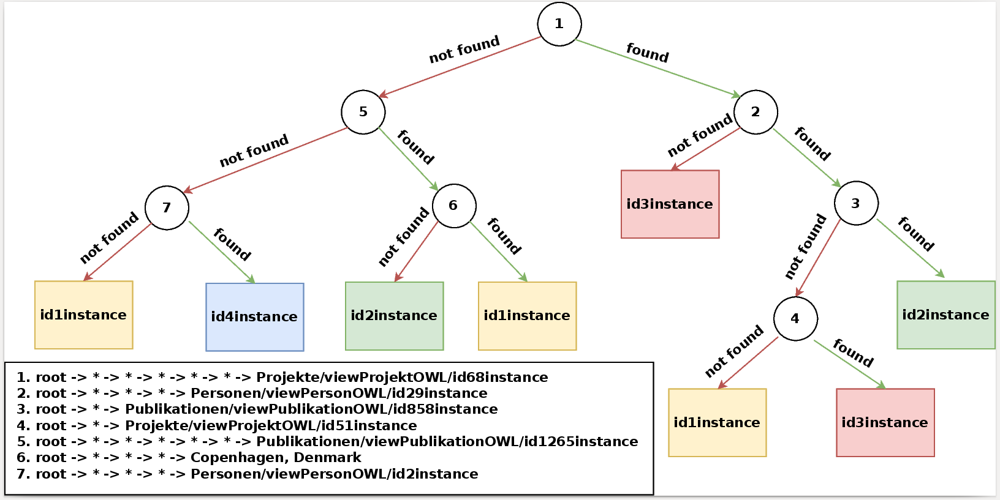

# Knowledge Graph Path Tree (KGPTree)

This repository contains an implementation of the algorithm discussed in "Inducing a decision tree with discriminative paths to classify entities in a knowledge graph" by Gilles Vandewiele, Bram Steenwinckel, Femke Ongenae and Filip De Turck

## What is a KG Path Tree?

A KG Path Tree is a single decision tree in which each internal node tests for the presence of a certain walk in a sample's graph neighborhood. Our walks are of a specific form: a walk of length `l` starts with a root, followed by `l - 2` wildcards (`*`) and then a named entity. An example could be: `root -> * -> * -> * -> Ghent` which would match the walk `Gilles Vandewiele --> studiedAt --> Ghent University --> locatedIn --> Ghent`. For this, root is replaced by the instance which we are classifying. 

Another example is displayed below. With this decision tree, we try to classify researchers into one of four research groups ([benchmark dataset AIFB](https://en.wikiversity.org/wiki/AIFB_DataSet)). In the root node, we find the walk `root -> * -> * -> * -> * -> * -> viewProjektOWL/id68instance`. When this walk can be found in the neighborhood of an instance, it can no longer be of the research affiliation `id4instance`, as this leaf does not occur in the subtree on the right. Moreover, this type of walk already demonstrates the added value of having a fixed depth, by the use of wildcards, in our walk. As a matter of fact, we could end up in an entity which is of a Project type in only two hops (e.g. `root -> * -> viewProjektOWL/id68instance`) from an instance in AIFB, but this results in a lot less information gain than when six hops need to be taken. It appears that only two people, who are both from affiliation `id3instance`, are directly involved in the Project `id68instance`, or in other words where this path with only two hops could be matched. On the other hand, it appears that these two people have written quite a large amount of papers with the other researchers in their affiliation. As such, a walk that first hops from a certain person (the root) to one of his or her papers, and going from there to one of the two people mentioned earlier through a `author` predicate can be found for 45 people from affiliation `id3instance`, 3 people from `id2instance` and 2 people from `id1instance`.

 

## How can I make a KG Path Tree on my own dataset?

Dead simple! Our algorithm requires the following input:
* A Knowledge Graph object -- we implemented our own Knowledge Graph object. We provide a function `KnowledgeGraph.rdflib_to_kg` to convert a graph from [rdflib](https://github.com/RDFLib/rdflib).
* A list of train URIs -- our algorithm will extract neighborhoods around these URIs (or nodes in the KG) to extract features from
* A list of corresponding training labels -- should be in same order as the train URIs

For the AIFB dataset, this becomes:
```python3
import rdflib
import pandas as pd
from sklearn.metrics import accuracy_score

from tree_builder import KGPTree
from datastructures import *

g = rdflib.Graph()
g.parse('data/AIFB/aifb.n3', format='n3')

train_data = pd.read_csv('data/AIFB/AIFB_train.tsv', sep='\t')
train_entities = [rdflib.URIRef(x) for x in train_data['person']]
train_labels = train_data['label_affiliation']

test_data = pd.read_csv('data/AIFB/AIFB_test.tsv', sep='\t')
test_entities = [rdflib.URIRef(x) for x in test_data['person']]
test_labels = test_data['label_affiliation']

kg = KnowledgeGraph.rdflib_to_kg(g, label_predicates=label_predicates)

clf = KGPTree(kg, path_max_depth=6, neighborhood_depth=8, min_samples_leaf=1, max_tree_depth=5)

clf.fit(train_entities, train_labels)

preds = clf.predict(test_entities)
print(accuracy_score(test_labels, preds))
```

We provided an example Jupyter notebook as well (`kgptree/Example (AIFB).ipynb`).

## Reproducing results

In order to reproduce the results, we provide a `kgptree/experiments/benchmark.py`. It will perform multiple runs on four datasets (AIFB, BGS, MUTAG and AM) and will write away the results of each run to `kgptree/experiments/output` for further processing.
